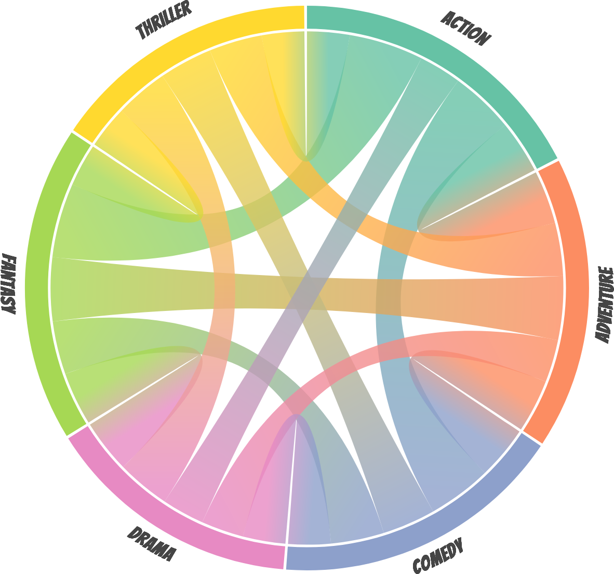
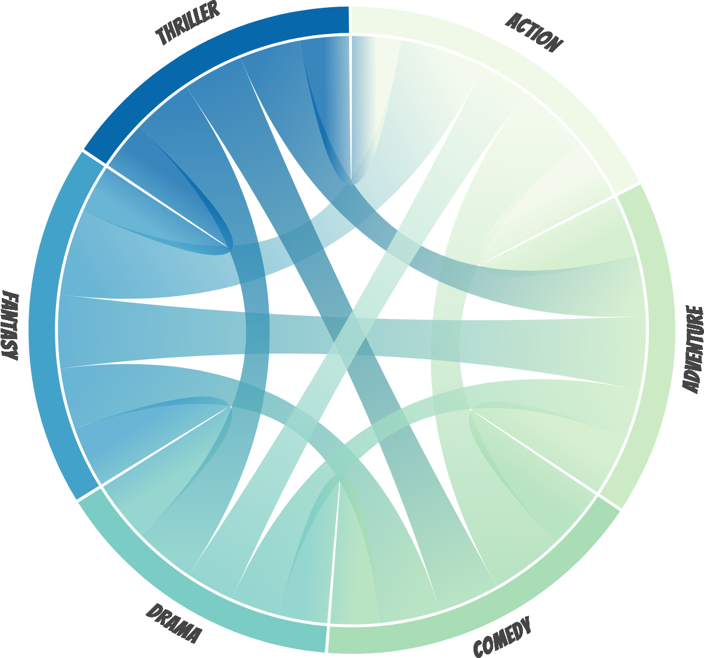
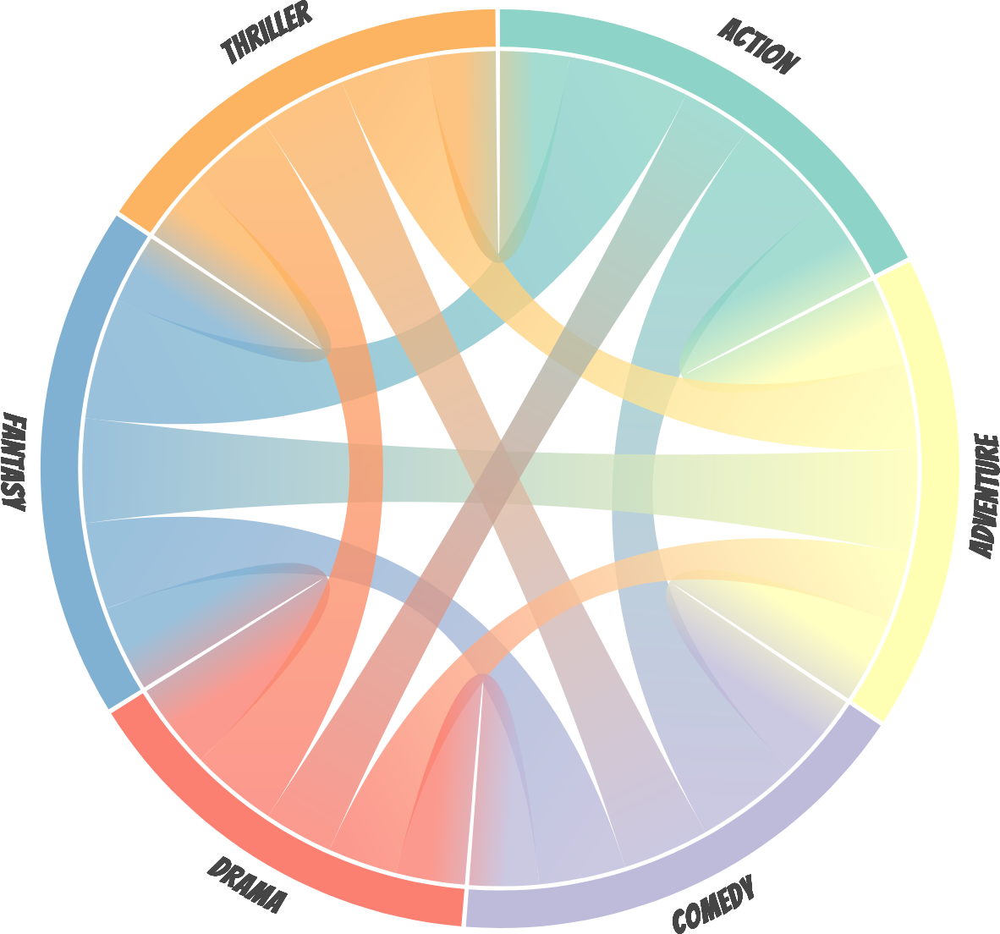
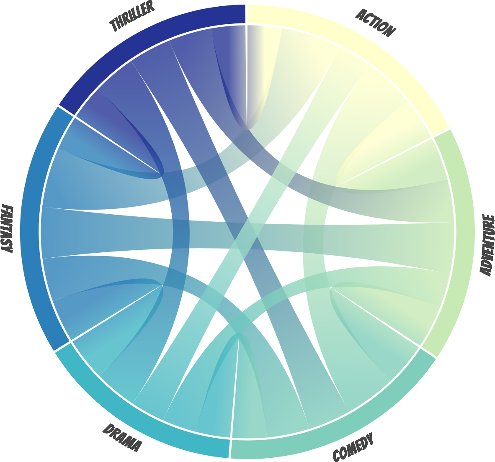
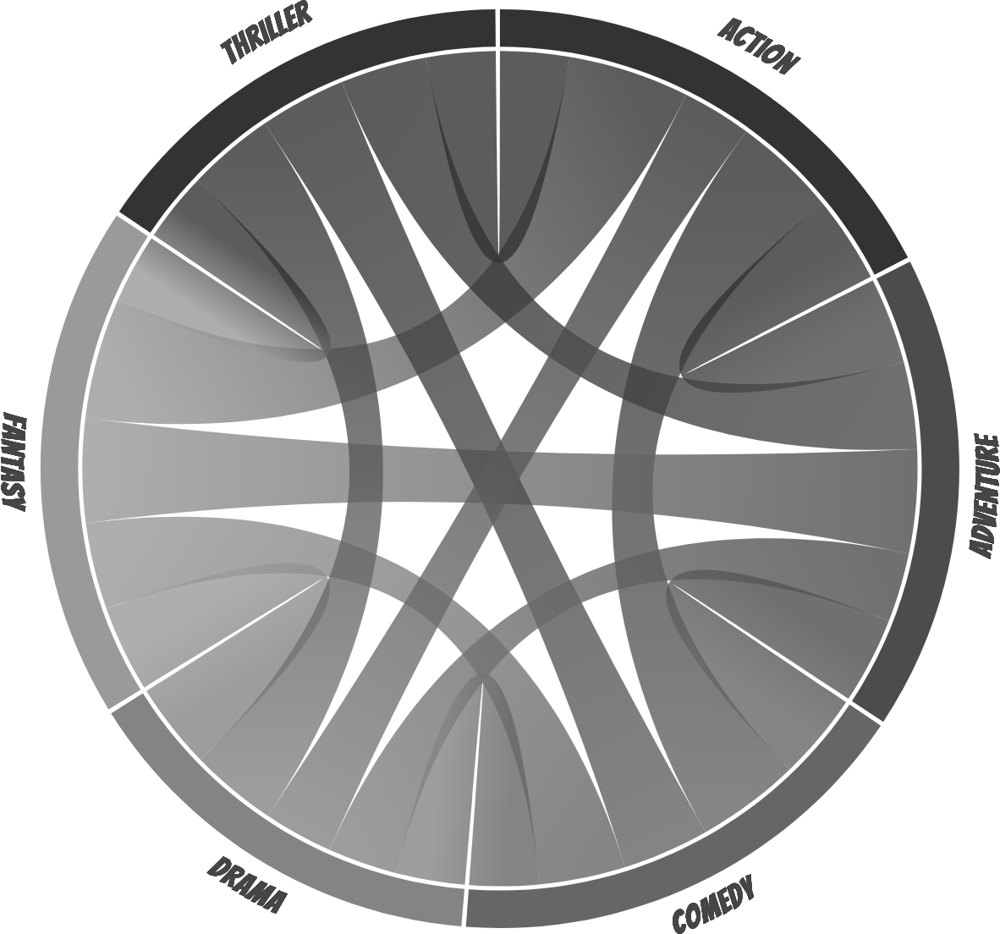
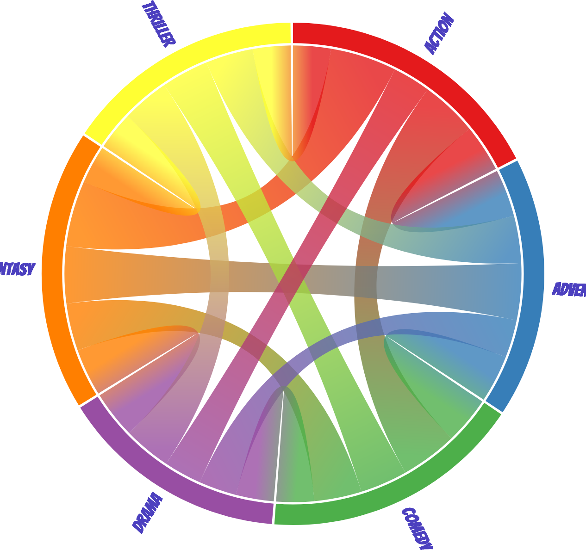
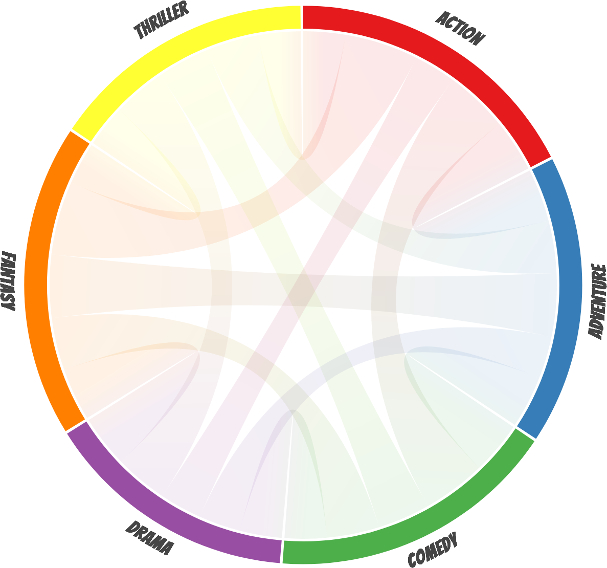

# Chord PRO Released

[Chord PRO](https://m8.fyi/chord) is the full-featured chord visualization API, producing beautiful interactive visualizations, e.g. those featured on the front page of Reddit.

- Produce beautiful interactive Chord diagrams.
- Customize colours and font-sizes.
- Access Divided mode, enabling two sides to your diagram.
- Add images and text on hover,
- Access finer-customisations including HTML injection.
- Allows commercial use without open source requirement.
- Currently supports Python, JavaScript, and Rust, with many more to come (accepting requests).

[Get it here!](https://m8.fyi/chord)


# Changelog:

- **03 October 2020** - [`Chord PRO`](https://store.shahinrostami.com/product/chord-pro/) now supports visualising [occurrences as well as co-occurrences](https://github.com/shahinrostami/chord/issues/18#issuecomment-703174362).

- **29 August 2020** - [`Chord PRO`](https://store.shahinrostami.com/product/chord-pro/) now supports enabling a Download to image button.

- **16 August 2020** - [`Chord PRO`](https://store.shahinrostami.com/product/chord-pro/) now supports radius scaling and bipartite titles.

- **13 August 2020** - [`Chord PRO`](https://store.shahinrostami.com/product/chord-pro/) now supports Arc numbers.

- **23 July 2020** - [`Chord PRO`](https://store.shahinrostami.com/product/chord-pro/) now supports figure titles.

- **20 July 2020** - [`Chord PRO`](https://store.shahinrostami.com/product/chord-pro/) now supports asymmetric mode using `symmetric=False`! You can also override the `verb` used in the popup.

- **14 July 2020** - [`Chord PRO`](https://store.shahinrostami.com/product/chord-pro/) can now be enabled by entering your [license key](https://store.shahinrostami.com/product/chord-pro/).


- **29 June 2020** - Optimisation and bug fixes to the tooltip have massively improved the interactive performance of the visualisation (**Rebuild your chord diagrams** to take advantage of this change).

- **22 May 2020** - Optimisation and bug fixes have massively improved the interactive performance of the visualisation (**Rebuild your chord diagrams** to take advantage of this change).

- **21 May 2020** - Please update to the latest version of `chord`. Backwards compatibility has been introduced, so from this version onwards, new versions won't break older ones!


# Introduction

In a chord diagram (or radial network), entities are arranged radially as segments with their relationships visualised by arcs that connect them. The size of the segments illustrates the numerical proportions, whilst the size of the arc illustrates the significance of the relationships<sup id="fnref-footnote"><a class="footnote-ref" href="#fn-footnote">1</a></sup>.

Chord diagrams are useful when trying to convey relationships between different entities, and they can be beautiful and eye-catching.

# The Chord Package

I wanted to do a section on Chord Diagrams for my book, [Data Is Beautiful](https://store.shahinrostami.com/product/data-is-beautiful/).

With Python in mind, there are many libraries available for creating Chord diagrams, such as [Plotly](https://plotly.com/python/v3/filled-chord-diagram/), [Bokeh](http://docs.bokeh.org/en/0.12.0/docs/gallery/chord_chart.html), and a few that are lesser-known. However, I wanted to use the implementation from [d3](https://observablehq.com/@d3/chord-diagram?collection=@d3/d3-chord) because it can be customised to be highly interactive and to look beautiful.

I couldn't find anything that ticked all the boxes, [so I made](https://pypi.org/project/chord/) a wrapper around d3-chord myself. It took some time to get it working, but I wanted to hide away everything behind a single constructor and method call. The tricky part was enabling multiple chord diagrams on the same page and then loading resources in a way that would support Jupyter Lab.

The primary support is for `Jupyter Lab` (not the older `Jupyter Notebook`).

# Installation

Available on https://pypi.org/project/chord/ through `pip`:

```bash
pip install chord
```

# Usage

## Python

## Python (HTML file)

```python
Chord(matrix, names).to_html()
```

## Jupyter Lab (Notebook)

```python
Chord(matrix, names).show()
```

## Defaults

```python
Chord(self,
        matrix,
        names,
        colors="d3.schemeSet1",
        opacity=0.8,
        padding=0.01,
        width=700,
        label_color="#454545",
        wrap_labels=True,
        margin=0,
        credit=False,
    )
```

# Examples

You can see the actual interactive examples [on this page](https://shahinrostami.com/posts/statistics/data-is-beautiful/chord-diagrams/). The below examples are screenshots.

## The Dataset

The focus of this section will be the demonstration of the `chord` package. To keep it simple, we will use synthetic data that illustrates the co-occurrences between movie genres within the same movie.

```python
matrix = [
    [0, 5, 6, 4, 7, 4],
    [5, 0, 5, 4, 6, 5],
    [6, 5, 0, 4, 5, 5],
    [4, 4, 4, 0, 5, 5],
    [7, 6, 5, 5, 0, 4],
    [4, 5, 5, 5, 4, 0],
]

names = ["Action", "Adventure", "Comedy", "Drama", "Fantasy", "Thriller"]
```

## Default Settings

Let's see what the `Chord()` defaults produce when we invoke the `show()` method.

```python
Chord(matrix, names).show()
```


You can also save it to an HTML file.

```python
Chord(matrix, names).to_html()
```

## Different Colours

The defaults are nice, but what if we want different colours? You can pass in almost anything from [d3-scale-chromatic](https://github.com/d3/d3-scale-chromatic#categorical), or you could pass in a list of hexadecimal colour codes.

```python
Chord(matrix, names, colors="d3.schemeSet2").show()
```



```python
Chord(matrix, names, colors=f"d3.schemeGnBu[{len(names)}]").show()
```



```python
Chord(matrix, names, colors="d3.schemeSet3").show()
```



```python
Chord(matrix, names, colors=f"d3.schemePuRd[{len(names)}]").show()
```


```python
Chord(matrix, names, colors=f"d3.schemeYlGnBu[{len(names)}]").show()
```



```python
hex_colours = ["#222222", "#333333", "#4c4c4c", "#666666", "#848484", "#9a9a9a"]

Chord(matrix, names, colors=hex_colours).show()
```



## Label Styling

We can disable the wrapped labels, and even change the colour.

```python
Chord(matrix, names, wrap_labels=False, label_color="#4c40bf").show()
```



## Opacity

We can also change the default opacity of the relationships.

```python
Chord(matrix, names, opacity=0.1).show()
```



# Diagram Size

We can change the maximum diagram size by specifying a width.

```python
Chord(matrix, names, width=400).show()
```

We can change the padding between chord segments by specifying the padding.

```python
Chord(matrix, names, padding=0.3).show()
```

<div class="footnote">
<hr>
<ol>
<li id="fn-footnote">
<p>Tintarev, N., Rostami, S., & Smyth, B. (2018, April). Knowing the unknown: visualising consumption blind-spots in recommender systems. In Proceedings of the 33rd Annual ACM Symposium on Applied Computing (pp. 1396-1399).&nbsp;<a class="footnote-backref" href="#fnref-footnote" title="Jump back to footnote 1 in the text">↩</a></p>
</li>
</ol>
</div>

# Credits

- d3-chord, Mike Bostock.
- d3-chord gradient fills, Nadieh Bremer.
- `chord` (Python), Shahin Rostami.


```

```
